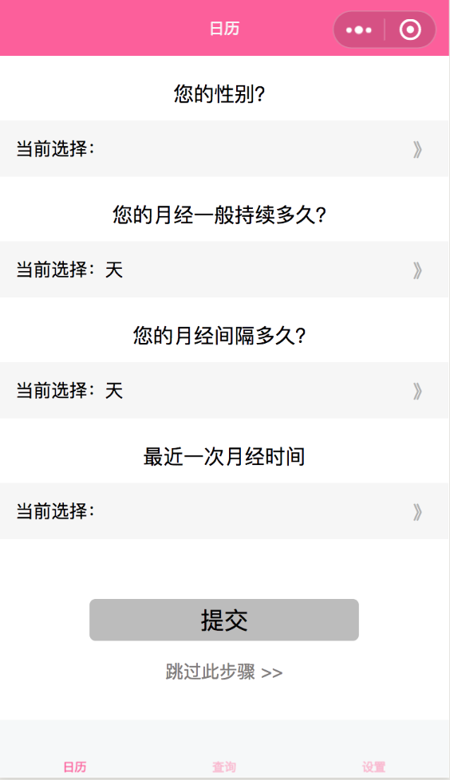
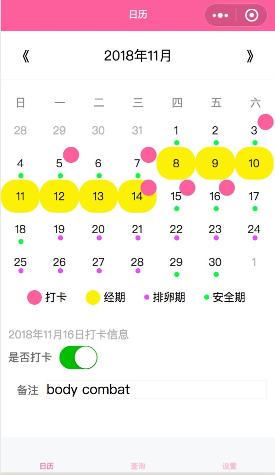

# 运动时谁还不来个姨妈

### 一个结合大姨妈的运动打卡小程序

去年年底办了张健身卡开始去健身房运动，没想到原来特别不喜欢运动的我竟然坚持了一年了。我觉得我能坚持这么久有一个很重要的原因就是每次运动完我都会在日历上标记我今天做了哪些运动，这样一个月过完就能知道自己运动了多少次，做了哪些运动，真是满满的成就感。之前一直在日历上手写标记的，这种方式的缺点不要太明显哦：不方便携带，一年过完第二年的时候前一年的日历很有可能被扔掉，每次想跟别人炫耀的时候还要翻出日历，真是太麻烦了。而且作为一个妹子每次大姨妈快来的时候也不能做太激烈的运动，还要提前多喝热水，真是心累。这时候就急需一个可以又能帮我运动打卡又能帮我计算大姨妈日历的应用。鉴于以上说的问题，今天要介绍的小程序的原型就诞生啦。

那就撸起袖子写起来吧。

## 准备工作

1.开发工具：

Atom( https://atom.io/ )， 微信开发者工具 ( https://developers.weixin.qq.com/miniprogram/dev/devtools/debug.html )
本人是Atom的死忠粉，最主要原因是我觉得他长得好看。这边给大家推荐Atom写小程序的一个插件
https://juejin.im/post/5b213182e51d4506c76699ad

2.基础知识准备：

排卵期：排卵日为下次月经前的14天，排卵日的前5天和后4天，共10天，都算为排卵期

安全期：月经后的第一天到排卵期开始的前3天  我理解是剩下的时间都是安全期

## 功能

1. 运动打卡
2. 标记大姨妈，在快来之前给个提醒
3. 问了下老领导，他觉得作为一个老爷们，大姨妈就算了，可是计算排卵期、安全期这种还是很需要的，毕竟。。。。

## 项目结构

组件化思想：
上面介绍了小程序需要实现的功能，为了实现这些功能我们一共设计了三个页面，分别是：日历页面、查询页面以及个人信息页面。
其中，日历页面主要是设置自己的姨妈时间，计算经期、安全期、排卵期并且能够记录运动打卡。

{: width="282px" height="487px"}
{: width="282px" height="487px"}

查询页面的功能主要是查询他人的经期、安全期、排卵期，毕竟这个小程序不止面向妹子使用嘛😄😄，页面与日历页面基本一致，去掉了打卡功能。

个人信息页面的功能是展示个人信息，提供重新设置姨妈时间的入口。

综上，妹子们主要使用的是日历页面以及个人信息页，汉子可以使用日历记录运动打卡，查询页面查询他人的经期、安全期、排卵期。

在分析了以上三个页面之后发现：三个页面都涉及到日历组件、填写基本信息组件，设置页面还涉及到用户信息展示组件。所以我们这边采用组件化思想，把公共的组件以及可复用的模块都拆成组件，在使用组件的页面把属性传递到组件，组件可以直接使用。这样做的好处是页面结构会更加清晰，并且耦合度大大降低。

下面是项目的组件以及页面目录：

```
├── components               # 页面用的到所有组件
    ├── calendar             # 日历组件
    ├── settings             # 设置组件
    └── userInfo             # 用户信息组件
├── pages                    # 页面
    ├── calendar             # 日历页面
    ├── settings             # 设置页面
    └── userInfo             # 用户信息页面
├── utils                    # utils
    ├── regenerator-runtime  # 使用async await需引入
    ├── apis.js              # 接口定义
    ├── const.js             # 定义常量
    └── util.js              # 定义公用方法
├── app.js                   # app.js
├── app.json                 # 小程序的全局配置
├── app.wxss                 # 样式
├── package-lock.json        # package-lock.json
└── project.config.json      # 个性化配置
```

## 数据存储：
为了先实现前端的功能，我们这边的数据目前都是存储在了本地，使用了wx.getStorage和wx.setStorage来对数据进行读取与存储。为了以后数据能够方便地扩展到数据库，我们这边统一在api文件中通过异步的方式进行包装。

```
getSettingInfo: (key) => {    //获取setting信息
  return new Promise((resolve, reject) => {
    wx.getStorage({
      key: key,
      success: function(res) {
        resolve(util.jsonParse(res.data))
      },
      fail: function(e) {
        console.log('getSettingInfo fail', e)
        resolve({})
      }
    })
  })
}
```

数据存储部分等后续实现会再更新


待解决问题：
1、对我自己来说，大姨妈来之前的日期与之后的日期其实是有两个需求：大姨妈来之后的主要是预测，就是我们目前已经实现了的功能；之前其实是已经发生了的，需要想把每次的时间记录下来，方便后面进行分析。所以后面需要实现记录每次大姨妈的时间，并进行分析。
2、实现数据存储部分的逻辑。

`github`地址：
https://github.com/SummerRouXin/big-aunt

预览


bug:
1、标记当天